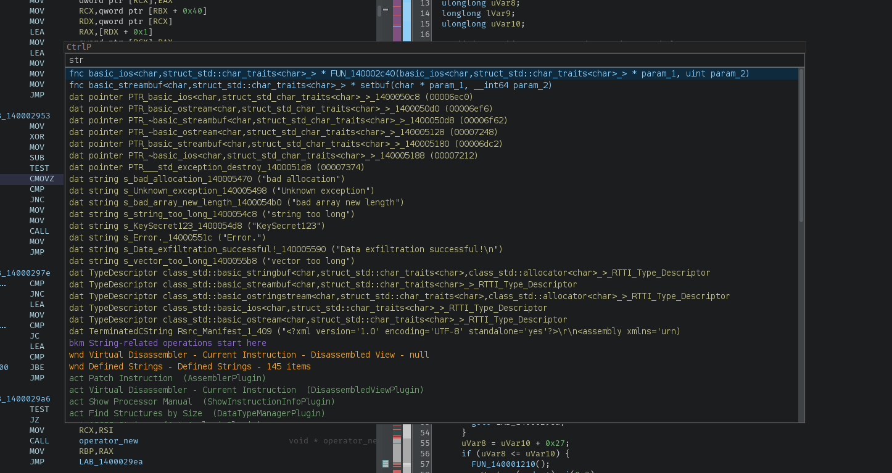

# Ghidra CtrlP Script

Ghidra is great, but I hate how mouse-driven it is by default. One thing
I love in VS Code is the Ctrl+P file switcher and command pallete. I figured,
it would be nice to have this in ghidra.

With this script you can just press Ctrl+P and do ~~anything~~ a lot.

### Installation

**Core:** Put `ctrlp.py` in `~/ghidra_scripts` or your prefered script location.
Then go to `Window -> Script manager` and reload.

**Launcher:** Put `CtrlPQuicklaunchScript.java` in `~/ghidra_scripts`, and assign
a keybinding (the launcher role is to cache `ctrlp.py` script).

I strongly recommend adding a keyboard shortcut (in `Window -> Script manager`).
If you don't want to sue `Ctrl+P`, you can assign any other hotkey you want. If you use `Ctrl+P`,
remember to unasign `Print` from the `Tool Options -> Keybindings`, otherwise Ghidra will
ask you an annoying question every time.

### Basic features

When you run this script (remember to add a keybinding), a modal window appears and you may search for:

| Data type | Description                     |
| --------- | ------------------------------- |
| Functions | Quickly navigate to any function |
| Data      | Jump to data defined in memory |
| Labels    | Search the labels in your program |
| Bookmarks | Browse bookmarks without using a keyboard |
| Windows   | Switch to or open any window instantly |
| Scripts   | Launch scripts without painfully browsing the script manager |
| Actions   | Run any available action, even if you don't remember the keybinding |

Some of the available data types are visible on the screenshot below:

### Slightly more advanced features

**Keybindings**

Other than the obvious (arrows, home/end, page up/down), you can press:

| Keybinding | Description                    |
| --------- | ------------------------------- |
| `ENTER` | accept the current selection (go to the selected location, or execute the selected script, etc). |
| `Ctrl+Enter` | Go to the first XRef of the selected location if one exists. |
| `ESC` | close the current window without doing anything |
| `Ctrl+c` | copy a text of the highlighted element |
| `Ctrl+Shift+c` | copy address (if any) of the highlighted element |
| `Ctrl+d` | toggle a quick bookmark at the highlighted location (add, or remove if exists). Bookmarked symbols are shown with a `[*]` tag at the end (you can filter by this too). |
| `Ctrl+q` | by default the window is only hidden when closed (to speed up future executions). Press this shortcut to forcefully really close the window. May be useful to restart script in case of a bug. |

**Filtering**

In the future we may implementsomething fzf-like, but for now the algorithm is simpler. User input is split on whitespace, for example `main get int` is split into `["main", "get", "int"]`.
To match, text must contain ALL of these fragments. In practice this seems to work very well for me.

*One exception: filtering by "fnc", "bkm", "scr"... is special and restricts by type*

**Alternative modes**

I want this plugin to remain focused on quick jumping/command execution, but I couldn't resist blazing fast memory searches too.

If you start your query with `"`, `'` or `{`, you will get a list of search results instead of the usual contents. There are three modes:

| Prefix | Description                    |
| ------ | ------------------------------- |
| `"`    | Case sensitive text search  |
| `'`    | Case insensitive text search  |
| `{`    | Byte search (written in hex, wildcards not supported). |
| `=`    | Python calculator. You can use it for quick math (enter copies to clipboard). |

If you don't want this behaviour, you can disable it by prepending a space to your query.

Warning: it's **not** optimized: it will rescan whole program memory for every character typed. Avoid with large programs.

**Other notes**

The plugin tries to use `"FiraCode Nerd Font Mono"` font, and if that fails it falls back to `"Monospaced"`.
In the future maybe I'll try to get the default font for listing for example.

There is a support for dark theme (the colors adjust themselves).

### Disclaimer

This is my first Ghidra UI plugin, code quality could be much better. I'm using it daily, and I will slowly improve it.

If you like it, check out my [other project](https://github.com/msm-code/ghidralib) - [ghidralib](https://github.com/msm-code/ghidralib),
a Pythonic standard library for Ghidra.
